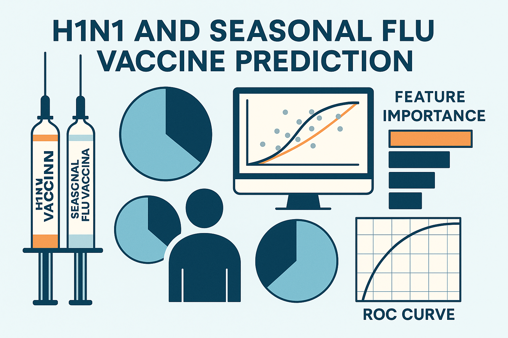
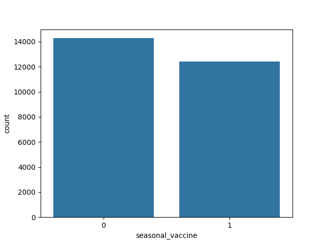
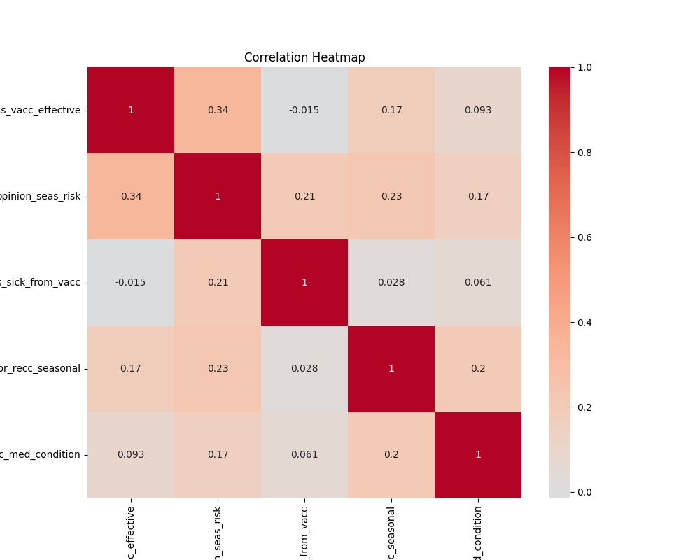
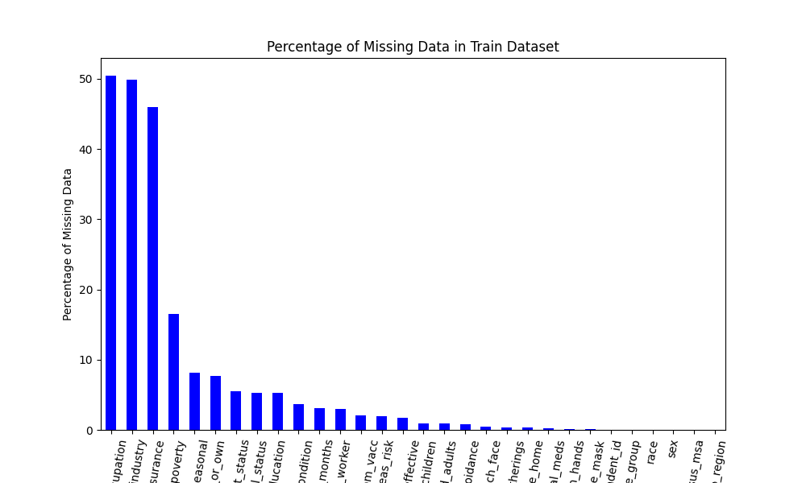
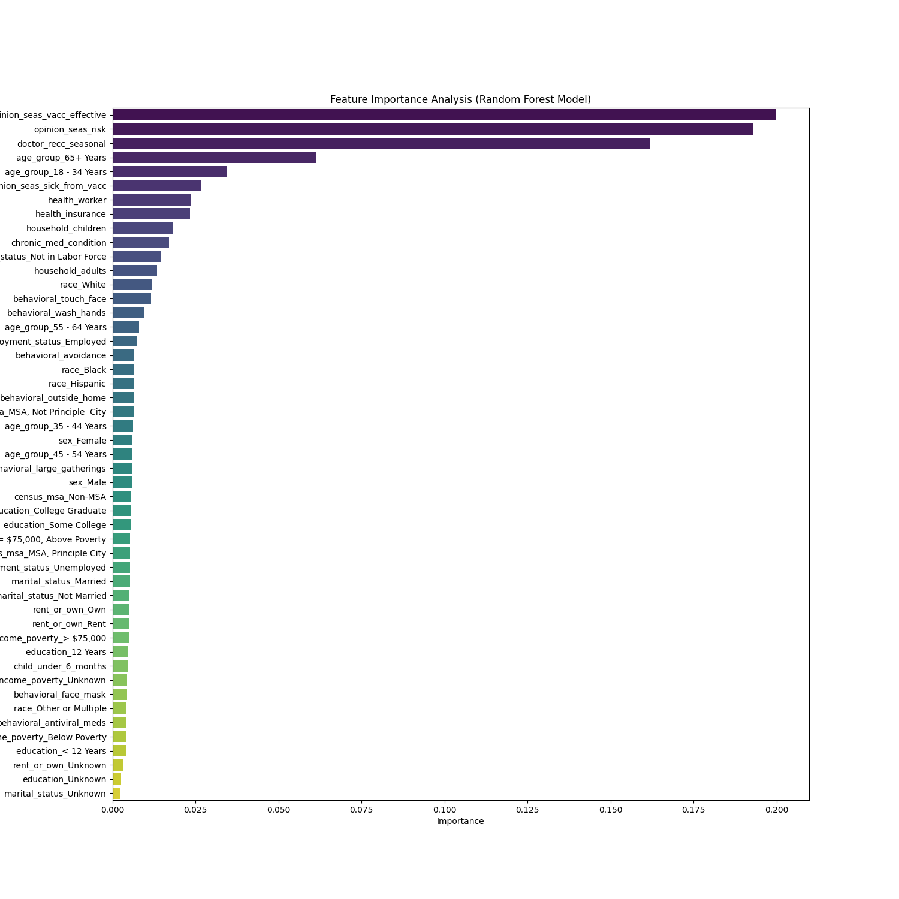
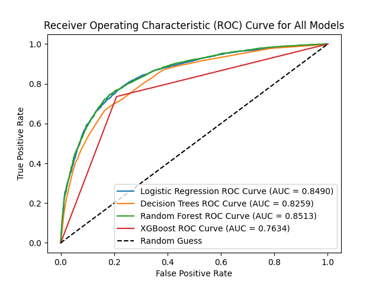

# Forecasting  Seasonal Flu Vaccine Adoption

Author: [Edwin Korir](https://github.com/Edwinkorir38?)

## Overview

This project aims to develop machine learning models to predict whether individuals received the **H1N1** and/or **seasonal flu vaccines** using a dataset collected during the 2009 H1N1 pandemic. Understanding vaccination behavior is essential for effective public health planning and targeted outreach during pandemics or annual flu seasons.

By leveraging demographic, behavioral, and perceptual features, this analysis seeks to identify patterns associated with vaccine uptake and enable data-driven public health interventions.

## Business and Data Understanding

Vaccination remains one of the most effective public health interventions for controlling the spread of infectious diseases. While vaccines offer individual protection and contribute to herd immunity, not everyone chooses to get vaccinated. This project explores what influences people's decisions to receive the seasonal flu vaccine—a critical tool for preventing widespread flu outbreaks.

### Stakeholder Audience

The intended audience for this analysis includes:
- **Public health officials and policy-makers**: To identify vaccine-hesitant populations and direct educational campaigns.
- **Healthcare providers**: To understand patient profiles that may benefit from additional engagement.
- **Data scientists and epidemiologists**: For building robust, predictive tools in health-related behavioral modeling.

Understanding which factors influence vaccine acceptance can help optimize limited resources during health crises and improve vaccine outreach programs.

### Dataset Description

The dataset used is from the **Flu Vaccines Prediction** challenge by DrivenData and includes **26,707 responses** to a public health survey. The key features include:

- **Demographics**: Age group, sex, race, education level, income level, marital status, etc.
- **Health Behavior**: Doctor visits, chronic medical conditions, employment in healthcare.
- **Perception Variables**: Concern about H1N1, perceived vaccine effectiveness, trust in government/health advice.
- **Target Variables**:
  - `h1n1_vaccine` — whether the respondent received the H1N1 vaccine (binary)
  - `seasonal_vaccine` — whether the respondent received the seasonal flu vaccine (binary)

The dataset presents a **multi-label classification** problem, where the goal is to predict each vaccine decision separately, though often correlated.But in our case we will only use seasonal_vaccine as it is relevant for our analysis here,we thus drop h1n1_vaccine.

##  Exploratory Data Analysis (EDA)

### Target Distribution
Most individuals **did not receive the seasonal flu vaccine** — highlighting the importance of identifying barriers to uptake.

This chart shows the proportion of individuals who received the seasonal flu vaccine versus those who did not. It highlights a potential class imbalance, which is critical when evaluating classification performance.

### Feature Correlations with Vaccine Uptake (Based on Related Features)

Some features exhibit positive correlations with perceptions and behaviors linked to vaccine uptake:
- **Positive**: `doctor_recc_seasonal`, `opinion_seas_vacc_effective`, `opinion_seas_risk`
- These features suggest that individuals who perceive the vaccine as effective or are recommended by doctors are more likely to vaccinate.

* This heatmap illustrates correlations among the dataset's numeric and encoded categorical features, helping identify multicollinearity and useful predictors.

### Missing Data Visualization
Handled missing values using appropriate imputations and domain knowledge.

* This chart shows the missing values in the train dataset which was also similart to the test dataset.

## Modeling

### Data Preprocessing

1. **Missing Value Treatment**: Categorical features with missing values were filled using mode imputation; numerical fields were handled using median values or appropriate replacements.
2. **Encoding**: 
   - Ordinal and nominal features were encoded using Label Encoding and One-Hot Encoding respectively.
3. **Feature Engineering**:
   - Derived new interaction features and evaluated feature importance using mutual information and model-based methods.
4. **Train-Test Split**:
   - Data was split using an 70/300 strategy with stratification to preserve class balance.

### Model Selection

Several classification models were evaluated:

- **Logistic Regression** (baseline)
- **Decision trees**
- **Random Forest Classifier**
- **XGBoost Algorithim.**

3. Feature Importance(Random Forest)

A Random Forest model was used to determine the most influential features for predicting seasonal flu vaccine uptake. Healthcare recommendations and vaccine perception variables showed high importance.
XGBoost emerged as the top-performing model due to its robustness, interpretability, and superior performance on imbalanced data.

### Hyperparameter Tuning

Hyperparameters were optimized using **GridSearchCV** and **RandomizedSearchCV**, tuned separately for H1N1 and seasonal vaccine tasks.

## Evaluation

Models were assessed using a suite of metrics suited for imbalanced classification:

- **Accuracy**: General correctness.
- **F1 Score**: Balances precision and recall.
- **ROC-AUC Score**: Measures class-separability, especially useful in imbalanced datasets.

### Results Summary:

###  Model Performance Table

| Model              | Accuracy (%) | Recall (%) | Precision (%) | Train AUC | Test AUC |
|-------------------|--------------|------------|----------------|-----------|----------|
| Logistic Regression | 78.2         | 73.9       | 77.4           | 85.0      | 85.2     |
| Decision Tree       | 75.8         | 67.5       | 76.9           | 83.1      | 82.6     |
| Random Forest       | 78.4         | 72.9       | 78.3           | 90.4      | 85.4     |
| XGBoost             | 77.0         | 74.0       | 75.3           | 87.5      | 76.7     |

### ROC Curve Comparison

##  Conclusion

###  The Data
Extensive data exploration and preprocessing were necessary, particularly to:
- Address missing values in critical fields
- Handle skewed distributions (e.g., race feature biased toward white participants)

###  The Models
Performance across models was fairly close, but the **Random Forest** model yielded the highest test AUC of **0.8539**.  
While hyperparameter tuning improved accuracy, class imbalance remains a challenge and may be addressed in future iterations for better performance.

###  Key Insights
- **Doctor recommendations** were a major driver in vaccination decisions.
- **Public perceptions** about vaccine **safety and effectiveness** significantly influenced uptake.
- **Age** was a strong predictor — older adults were more likely to be vaccinated.

##  Recommendations

- **Personalized Outreach**  
  Tailor vaccine messaging to individual concerns and reinforce positive perceptions.

- **Target Younger Populations**  
  Direct more public health messaging toward younger age groups, who are less likely to vaccinate.

- **Leverage Healthcare Providers**  
  Strengthen the role of medical professionals in encouraging vaccinations.

## Future Directions

- Explore **advanced feature engineering** for uncovering latent variables and interactions.
- Integrate **more recent datasets** (especially post-COVID-19) to reflect evolving public attitudes and behaviors for better generalization.

### For more information
Please review our full analysis in our **[Jupyter Notebook](H1N1_and_Seasonal_Flu_Vaccines.ipynb)**
  or our presentation.

For any additional questions, please contact **[Edwin Korir](https://www.linkedin.com/in/edduh-kip-01170b288?)**